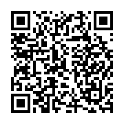

<!--
  Copyright 2024-2025 Hora Solis project contributors

  Licensed under the Apache License, Version 2.0 (the "License");
  you may not use this file except in compliance with the License.
  You may obtain a copy of the License at

      http://www.apache.org/licenses/LICENSE-2.0

  Unless required by applicable law or agreed to in writing, software
  distributed under the License is distributed on an "AS IS" BASIS,
  WITHOUT WARRANTIES OR CONDITIONS OF ANY KIND, either express or implied.
  See the License for the specific language governing permissions and
  limitations under the License.
-->

## <span lang="la">Hora Solis</span> – a Roman clock dividing day and night into temporal hours

**[<span lang="la">Hora Solis</span>](https://horasolis.github.io/)** is a digital reinterpretation of ancient [Roman timekeeping](https://en.wikipedia.org/wiki/Roman_timekeeping) — a system that aligns the day not with factory clocks or timezones, but with the movement of the sun across the sky.

Unlike modern timekeeping, which divides every day into 24 identical hours regardless of season or place, the Roman system divides *daylight* into twelve equal hours (*<span lang="la">horae</span>*) and *night* into four watches (*<span lang="la">vigiliae</span>*). The length of these hours shifts with the seasons — shorter in winter, longer in summer — because the sun sets the pace.

This project presents Roman time in a visual, intuitive form. It doesn’t just tell you the hour — it shows how the shape of the day is changing around you.

## Why this matters

Modern time exists to synchronize us. Timezones, standardized hours, and daylight saving are tools of industry — designed for factories, offices, and global schedules. They reduce time to something fixed and mechanical: a uniform rhythm imposed everywhere, detached from place, light, and season.

But natural time isn’t uniform. The sun doesn’t rise at 6:00 every day. Days lengthen and shorten, light shifts, and with it, our sense of being changes — even if the clock doesn’t reflect it.

Roman timekeeping invites us to see time differently: not as a grid to obey, but as a rhythm woven into the fabric of life. It expands and contracts with the sun, flows with the day, and settles into the night. It restores a deeper awareness of time — not as something measured, but as something lived.

You may find yourself planning your day differently — setting aside the evening *<span lang="la">vigiliae</span>* for quiet work, time with family, reading, or creative focus. If you follow a biphasic sleep rhythm, you might align your shorter rest with midday or early night, letting the first hours of darkness become a calm, intentional space. Or perhaps you’ll discover the quiet clarity of early morning, just as the world begins to wake.

May this project help you rediscover your own rhythm.

## What the interface displays

[See the live page](https://horasolis.github.io/).

The following reflects the Roman system of daily time:

* **<span lang="la">Tempus 🌞 diurnum / Tempus 🌚 nocturnum</span>**  
  A two-column display of day and night temporal hours.

* **Daytime hours Ⅰ–Ⅻ**  
  The twelve daytime hours measured from sunrise to sunset.

* **Night watches (<span lang="la">vigilia prima → vigilia quarta</span>)**  
  The night divided into four watches, each spanning three nighttime hours.

* **<span lang="la">Tempus somni</span>**  
  A suggested sleep period timed to support waking at sunrise.

* **<span lang="la">Longitudo 🌞 diei et 🌚 noctis</span>**  
  The duration of day and night, varying with the seasons.

* **<span lang="la">Dies civilis 🏛️</span>**  
  The civil time and date in modern notation.

* **<span lang="la">Ortus solis 🌅 / Occasus solis 🌇</span>**  
  Sunrise and sunset times for the current day.

* **<span lang="la">Tempus ad somnum capiendum 🛏️</span>**  
  Recommended bedtime for rising with the sun.

* **<span lang="la">Ortus solis die sequenti ⏭️🌅</span>**  
  Time of tomorrow’s sunrise.

* **<span lang="la">Cursus horologii 🐇/🐌</span>**  
  The pace of the clock, reflecting seasonal shifts in hour length.

## Supporting Hora Solis and future projects

If you appreciate the work behind [<span lang="la">Hora Solis</span>](https://horasolis.github.io/), consider supporting its [founding author](https://github.com/senotrusov). Your support honors the time and dedication already invested and helps make room for reflection, new ideas, and future projects beyond this one.

Donate with Bitcoin – bc1qn3cy5hg9esu8tt3kpq2t0khhjmqz7tmxpxfn4s



If you find this project helpful, share it with others who might like it — whether it’s chatting with friends or posting about it on social media. Every little mention helps it reach someone who might appreciate it.

## Future roadmap

These are some directions the project may take moving forward:

1. **Sleep configuration and multi-phase sleep**  
   Customizable sleep schedules, including support for segmented and other polyphasic sleep patterns.

2. **Adjustable solar event angles**  
   More precise control over when sunrise and sunset are considered to occur, by setting how far the sun is below the horizon.

3. **Task planning**  
   Ways to organize the day around natural light and solar rhythms.

4. **Calendar integration**  
   Syncing with external calendar services to keep everything aligned.

Bringing these ideas to life will take time and effort. Whether or not they happen depends on how much interest the project receives. Donations are one way to show support and help shape what comes next.

## License

Unless otherwise noted below, the contents of this project are licensed under the [Apache License, Version 2.0](LICENSE). Some components may be provided under different terms, such as the MIT License or public domain.

* [NOAA Solar Calculator](https://gml.noaa.gov/grad/solcalc/), provided by Global Monitoring Laboratory of the National Oceanic and Atmospheric Administration (NOAA), Boulder, Colorado, USA (https://gml.noaa.gov).

  To the best of my knowledge, the NOAA Solar Calculator code is in the public domain.

* [temporal-polyfill](https://www.npmjs.com/package/temporal-polyfill), a lightweight polyfill for [Temporal](https://tc39.es/proposal-temporal/docs/), successor to the JavaScript `Date` object.

  ```
  MIT License

  Copyright (c) 2024 Adam Shaw

  Permission is hereby granted, free of charge, to any person obtaining a copy
  of this software and associated documentation files (the "Software"), to deal
  in the Software without restriction, including without limitation the rights
  to use, copy, modify, merge, publish, distribute, sublicense, and/or sell
  copies of the Software, and to permit persons to whom the Software is
  furnished to do so, subject to the following conditions:

  The above copyright notice and this permission notice shall be included in all
  copies or substantial portions of the Software.

  THE SOFTWARE IS PROVIDED "AS IS", WITHOUT WARRANTY OF ANY KIND, EXPRESS OR
  IMPLIED, INCLUDING BUT NOT LIMITED TO THE WARRANTIES OF MERCHANTABILITY,
  FITNESS FOR A PARTICULAR PURPOSE AND NONINFRINGEMENT. IN NO EVENT SHALL THE
  AUTHORS OR COPYRIGHT HOLDERS BE LIABLE FOR ANY CLAIM, DAMAGES OR OTHER
  LIABILITY, WHETHER IN AN ACTION OF CONTRACT, TORT OR OTHERWISE, ARISING FROM,
  OUT OF OR IN CONNECTION WITH THE SOFTWARE OR THE USE OR OTHER DEALINGS IN THE
  SOFTWARE.
  ```

## Get involved

Check out the [CONTRIBUTING](CONTRIBUTING.md) file to learn how to contribute, and the [CONTRIBUTORS](CONTRIBUTORS.md) file to see who’s helped make it happen.

## Further reading

### Roman timekeeping

* [Roman timekeeping](https://en.wikipedia.org/wiki/Roman_timekeeping), Wikipedia article.
* [Some Temporal Expressions in Suetonius](https://www.jstor.org/stable/261398) by John C. Rolfe.

### Solar calculations

* [NOAA Solar Calculator Details](https://gml.noaa.gov/grad/solcalc/calcdetails.html)

### Temporal API

* [MDN: `Temporal`](https://developer.mozilla.org/en-US/docs/Web/JavaScript/Reference/Global_Objects/Temporal)
* [TC39 Temporal Proposal Docs](https://tc39.es/proposal-temporal/docs/)
* [TC39 Temporal Cookbook](https://tc39.es/proposal-temporal/docs/cookbook.html)

### Sun azimuth

The sun’s azimuth is the compass direction from which sunlight is coming at a given point on Earth’s surface.
It is typically defined as the angle between the sun’s position and true north, measured clockwise:

* 0° = North
* 90° = East
* 180° = South
* 270° = West
* 360° = North (completing the circle)
